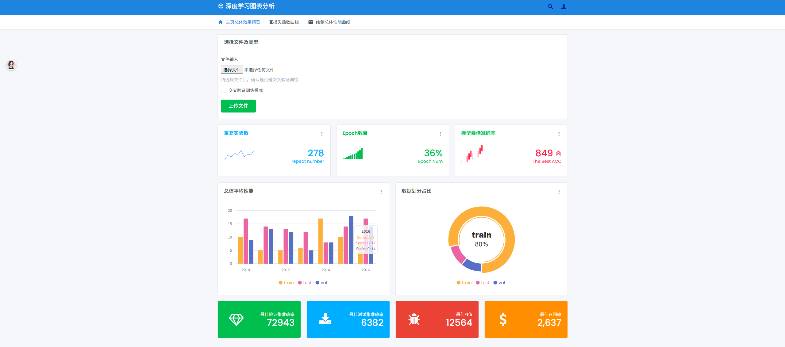
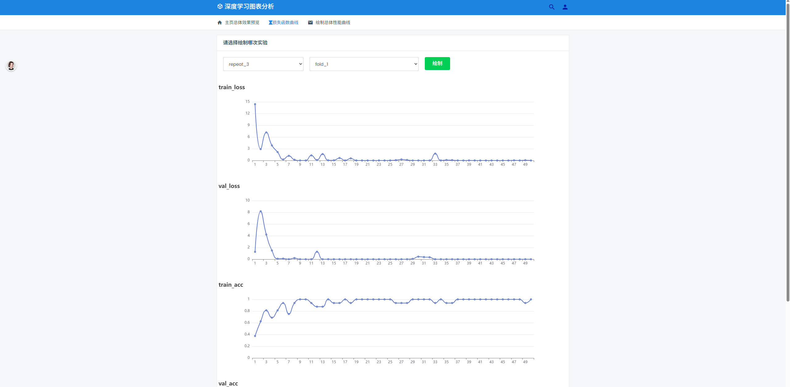
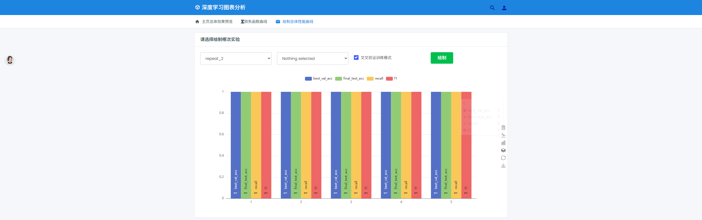

## 适用于脑电信号端到端深度学习模型训练的pytorch框架
> 创建日期：2025年4月17日
> 作者：wanxin

```C++
/*
项目文件结构
工作路径：./pytorch_example
--📂checkpoint
    ->best_model_repeat1-20250417_173703.pth  ：每一次实验保存的性能最好的模型
    ···
--📂configs
    ->model_config.json  :训练过程中的超参数设置，一般不要更改其结构，可以复制多份在main.py中填写相应路径
--📂dataset
    ->📂dataname1
    ->📂dataname2 ：可以是多个数据集，文件夹以数据集名称命名，数据集名称可以在json文件中配置
        ->📂S1
        ->📂S2
        ->📂S3  :被试文件夹，可以有多个被试，如果是被试独立实验需要在json文件中配置需要针对哪个被试实验
            ->📂session1 
            ->📂session2 ：每个被试可以有多次实验，如果只有一次实验，就只留一个文件夹就行
                ->📄sample_0.npy
                ->📄sample_1.npy
                ...
                ->📄sample_10.npy  :该被试的一次实验包含多个trails，每个trails保存为一个npy文件，npy文件的格式后面介绍    
--📂logs
    ->📂EEGNet-20250417_174017 :训练过程的数据保存的文件夹，命名规则是，模型名_日期_时间
        ->📄logs.json  ：训练过程的具体数据保存为json格式的文件
--📂models
    ->📂model_name 
    ->📂EEGNet  :不同模型保存在不同文件夹中，可以在json文件中配置选择的模型名称
        ->📄EEGNet.py  :具体的模型的类 
--📂out  ：可以自己在该文件夹中保存一点自己想要的结果，代码不会操作该文件夹
--📂picture  ：可以自己在该文件夹中保存一点自己想要的结果，代码不会操作该文件夹
--📂utils
    ->📄dataset.py : 声明了EEGDataset类，继承于pytorch的Dataset类，用来读取样本数据
    ->📄datasplit.py ：将数据按照一定比例随机划分为训练集/测试集/验证集，划分比例可以在json文件中配置
    ->📄drawData.py ：声明了绘图的类，具体食用方法会在示例代码中介绍
    ->📄read_json.py ：读取json文件的函数
    ->📄save_json.py ：保存json文件的函数
--📄main.py  ：程序入口，里面会有程序的使用示例
--📄ModelTrainer.py  ：模型训练的逻辑，以类的形式呈现，可以供大家自行写类继承


*/
```
>注意：模型的名称和具体的类的对应关系，需要在ModelTrainer.py中的第50行修改
#### 超参数配置文件说明
```json
{
  "model_name": "填写模型名称，需要和模型文件夹同名",   
  "data_name" : "填写数据集名称，需要和数据集文件夹同名",
  "data_root_path" : ".\\dataset\\",
  "save_logs_path": "./logs/",
  "save_model_path": "./checkpoint/",
  "learning_rate": "初始学习率",
  "batch_size": "batch_size",
  "epochs": 50,
  "repeat_time": "10：这个是模型训练的次数，每一次都是从头开始",
  "optimizer": "Adam:优化器，目前只写入了这一种，如需添加可以在ModelTrainer.py的initialize_optimizer函数中添加",
  "dropout_rate": 0.5,
  "activation_function": "ReLU：没什么用，还得取决于你具体模型中用的啥，不改也行",
  "loss_function": "CrossEntropyLoss：目前只写入了这一种，如需添加可以在ModelTrainer.py的initialize_loss函数中添加",
  "early_stopping": { 
    "Enable": "yes：早停策略，还没在训练中具体实现，如需要可以使用",
    "monitor": "val_loss",
    "patience": 10,
    "restore_best_weights": true
  },
  "learning_rate_decay": "yes：学习率衰减策略，也没在训练中实现，具体可以自己自定义",
  "init_seed": 42,
  "data_split:数据划分的比例": { 
    "train":0.8,
    "test": 0.1,
    "val": 0.1
  },

  "Subject_sigal：被试独立实验的，需要填写是在哪个被试上实验": {
    "sigal": "yes",
    "subject_name": "S1"
  }


}

```
#### npy数据格式说明:''data':脑电数据（导联数*采样点数），''label'：标签
```json
{'data': array([[ 0.73422146,  1.0643618 , -0.8760664 , ..., -0.6761451 ,
         1.6069859 ,  0.7272754 ],
       [ 1.7815675 ,  0.09552965,  0.21665184, ..., -0.31801918,
        -0.73996896, -0.6138159 ],
       [-1.0974427 , -0.7658083 , -0.26736796, ...,  0.0575758 ,
        -2.2482195 ,  0.24907291],
       ...,
       [ 0.48023748, -0.7256806 , -0.0512979 , ..., -0.38112995,
        -0.17092532, -1.173531  ],
       [-1.2511326 , -1.093581  , -1.772579  , ...,  0.8940185 ,
         2.4616046 , -0.23252268],
       [-0.907785  ,  0.2658302 ,  0.69808334, ..., -0.01930626,
        -0.8922807 , -0.67896014]], dtype=float32), 'label': 0}
```
#### 4.22增加了web端便捷绘图，以后会逐步完善细节功能
在文件夹 📂htmlDraw中，运行index.html

点击选择文件可加载训练过程中的数据，需要区分交叉验证和非交叉验证，上传文件后会显示一些总体信息
损失函数页面：可以选择绘制哪次实验和哪个折的数据绘制

总体信息包括四种，也需要选择哪次实验哪个折

#### 4.20增加了K折交叉验证的训练逻辑
```json

"Cross_validation" : {
    "selection": "yes",
    "Fload_Num": 5
  }
```
通过填写Fload_Num的值，控制K的值
目前通过K折交叉验证的训练数据无法绘图，正在开发web端交互式图表绘制


